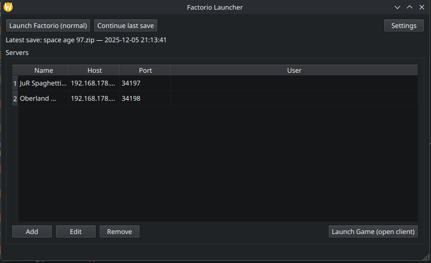
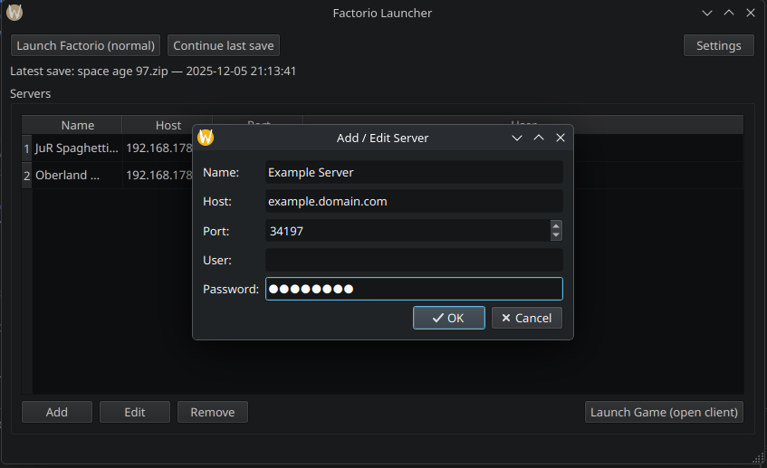
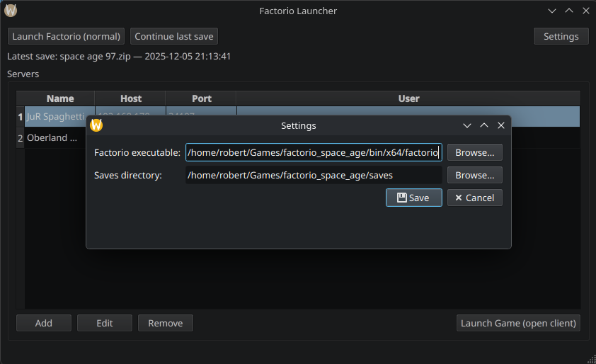

# 🚀 Factorio Quicklaunch


=======
# 🚀 Factorio Quicklaunch
### A KDE Plasma Launcher for Factorio (Fedora-Friendly)

**Factorio Quicklaunch** is a lightweight, Plasma-native launcher designed for Fedora + KDE users who want a clean and fast way to start Factorio.

It provides:

- ▶️ **Continue Last Save** — start the most recent local save instantly  
- 🌐 **Server List** — save servers and passwords; join with one click  
- 🎮 **Standard Game Launch** — open Factorio normally  
- 🧼 Python + PyQt6  
- 🔒 Optional password storage via KWallet  

---

## 📦 Features

### ▶️ Continue Last Save
Automatically detects the latest save file in your Factorio directory and launches directly into it.  
No menus, no clicks — just continue playing.

### 🌐 Server Management
Add and manage servers with:
- Server name  
- Host/IP  
- Port  
- Password (saved securely)  

Launch Factorio directly into a server with a single click.

### 🎮 Launch Game Normally
Starts Factorio without any flags for a standard game session.

---

## 🖥️ Requirements

- **Fedora** (any up-to-date version)  
- **KDE Plasma**  
- **Python 3.10+**  
- **PyQt6**  
- **KWallet / KDE Frameworks** (optional but recommended)  
- Factorio installed at:  
  `/usr/bin/factorio`  
  or configured manually in settings  

---

## 📁 Installation

Clone:

```bash
git clone https://github.com/yourname/factorio_quicklaunch.git
cd factorio_quicklaunch
````

Install dependencies:

```bash
pip install -r requirements.txt
```

Run the launcher:

```bash
python3 quicklaunch.py
```

(Optional) Add a menu shortcut:

```bash
cp factorio-quicklaunch.desktop ~/.local/share/applications/
```

Replace /path/to/quicklaunch.py with your actual file path.

```bash
[Desktop Entry]
Name=Factorio Quicklaunch
Comment=Launcher for Factorio with quick actions and server list
Exec=python3 /path/to/quicklaunch.py
Icon=factorio
Terminal=false
Type=Application
Categories=Game;
StartupNotify=true
```

---

## ⚙️ Configuration

All configuration files are stored under:

```
~/.config/FactorioQuicklaunch/
```

This includes:

* server list
* last selected server
* Factorio path
* window layout

Passwords are stored in **KWallet** if available, otherwise in a fallback encrypted config.

---

## 🖼️ Screenshot



=======


## 🤝 Contributing

Pull requests are welcome!
Ideas that help:

* Improved KDE integration
* Translation support
* Nicer UI layouts

---

## 📜 License

MIT License — use freely, modify freely.

---

## 💬 Final Notes

**Disclaimer:** This code was generated by an AI. Use at your own risk. I am not a programmer who knows what he is doing, but it works and i wanted to share.

=======


